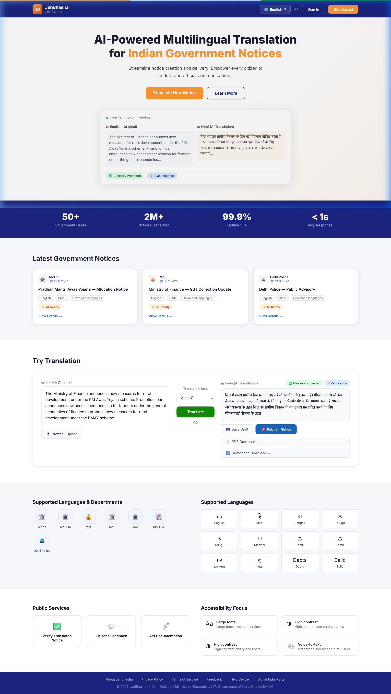
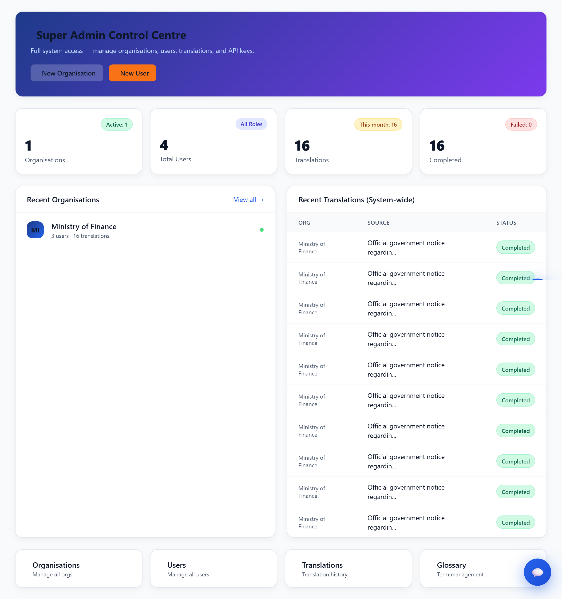
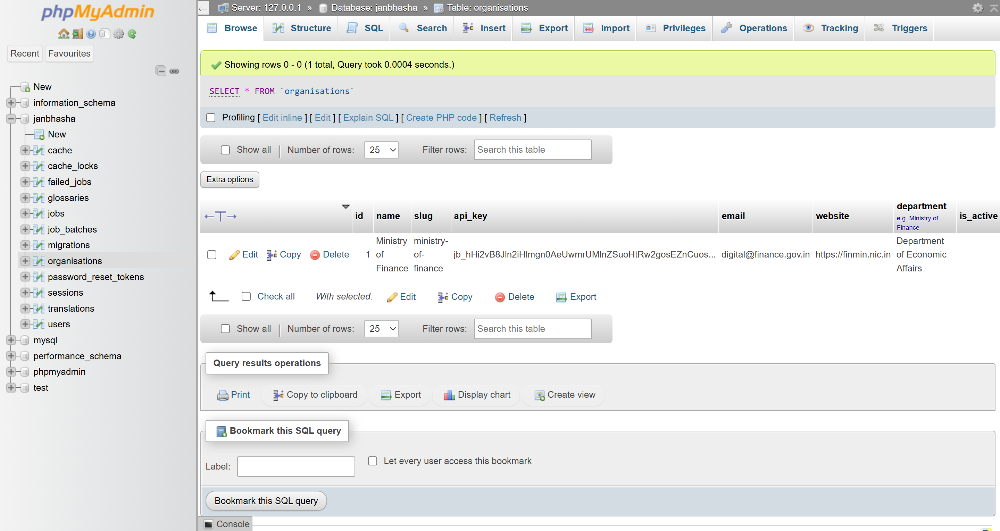
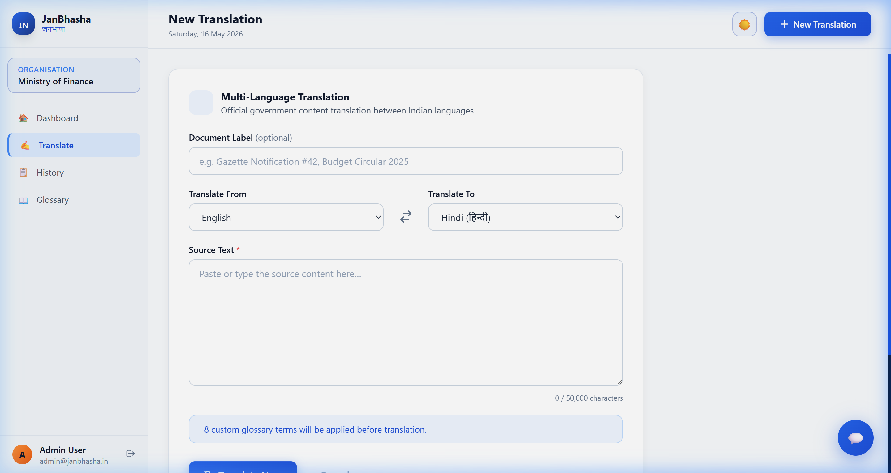
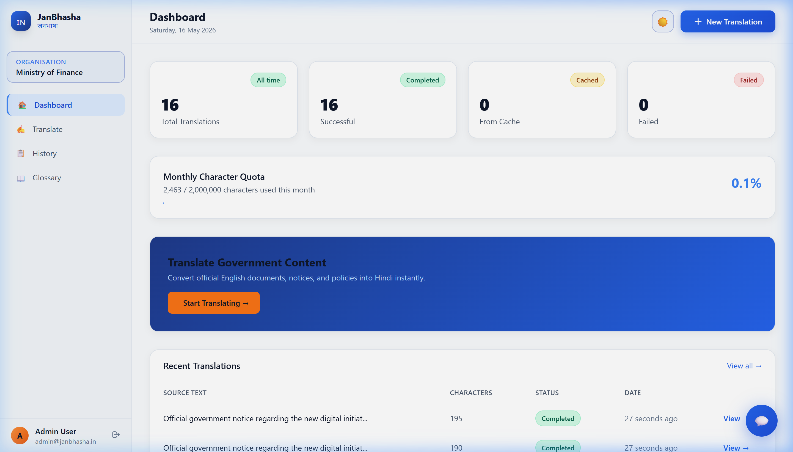
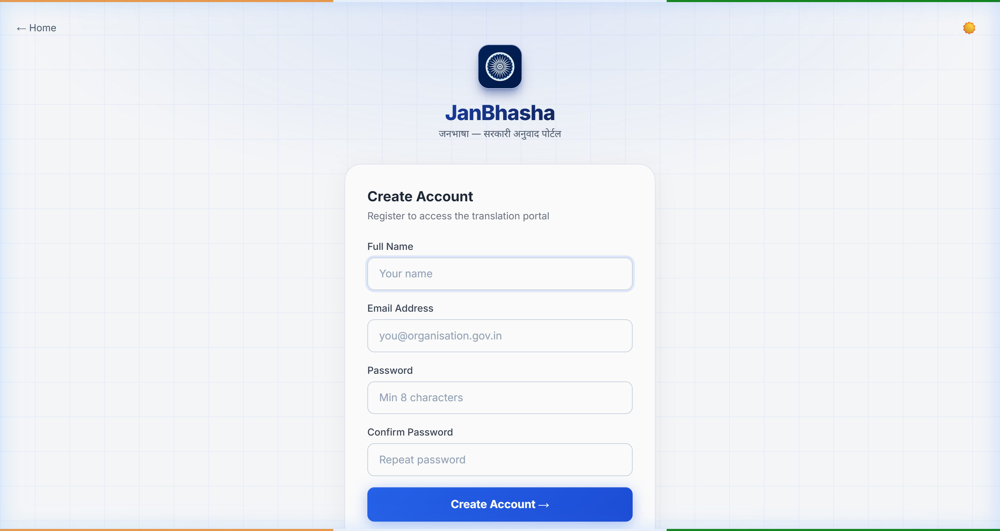
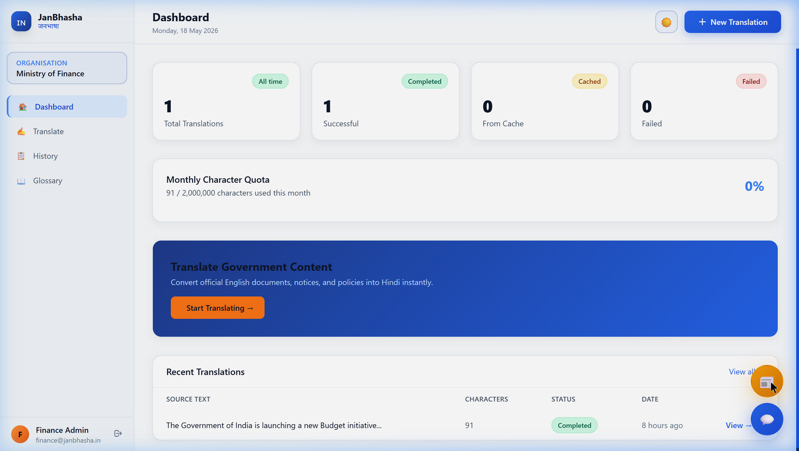
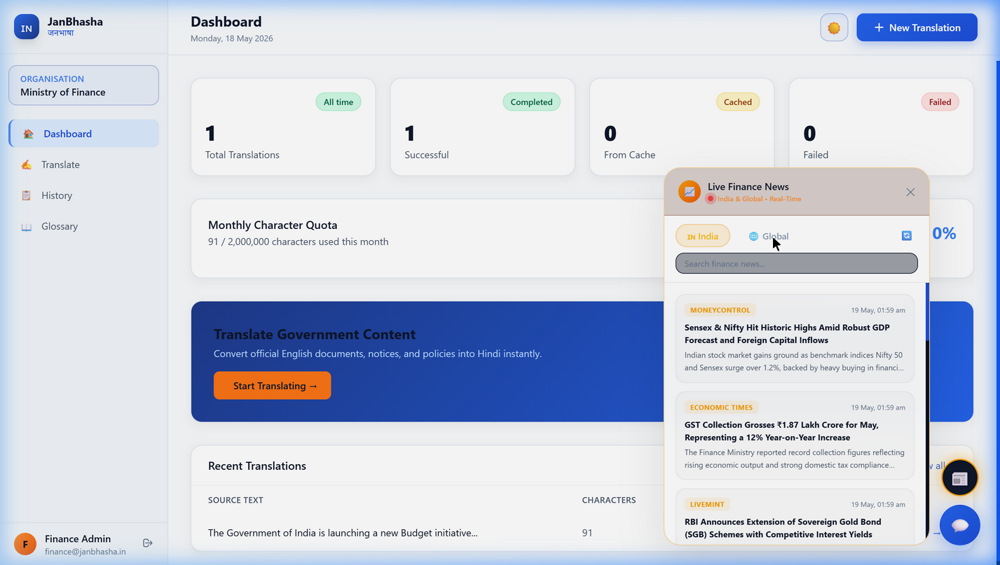
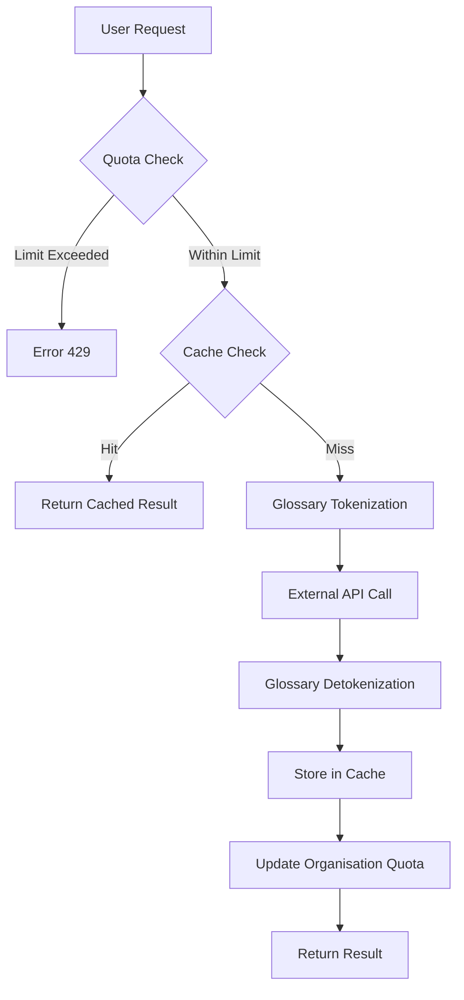
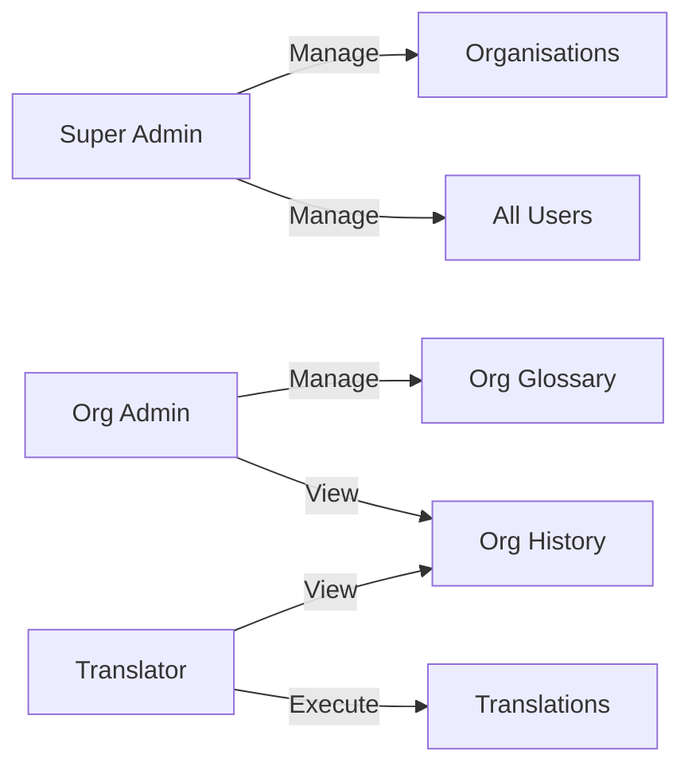

# JanBhasha — जनभाषा
### *Bridging Government Communication, One Word at a Time*

> 🚀 **Live Deployment:** [https://janbhasha.onrender.com](https://janbhasha.onrender.com)

---

## 📌 What is JanBhasha?

**JanBhasha** (जनभाषा — "language of the people") is a **multi-tenant SaaS translation platform** built exclusively for **Indian government departments and organisations**. It solves a critical problem in India's Digital India mission: official communications, circulars, and documents are produced in English but must reach citizens in their regional languages.

JanBhasha provides:
- A **futuristic web dashboard** for human translators and department admins to submit, track, and manage translations.
- A **secure REST API** so existing government IT systems can integrate translation programmatically via API keys.
- A **custom glossary engine** that prevents AI from incorrectly translating official terminology — ensuring "Ministry of Finance" always becomes "वित्त मंत्रालय".
- **Per-organisation monthly character quotas** with live usage tracking to control costs and prevent misuse.
- **Full audit logging** of every translation request with status, provider, character count, and cache information.
- **Role-based multi-tenancy** so data from one government organisation is completely isolated from another.

### 🎯 Target Audience

| User | Role | What They Do |
|---|---|---|
| Government Department | Organisation | Onboards on the platform; granted a monthly quota and API key |
| Translation Staff | `translator` | Submits text for translation and views their organisation's history |
| Department Head / IT Admin | `admin` | Manages glossary terms and views organisation-wide translation history |
| Platform Administrator | `super_admin` | Manages all organisations, users, API keys, and has global access |

### 🌐 Supported Languages

JanBhasha supports **Any-to-Any translation** between:
- All **22+ official Indian languages** including Hindi, Bengali, Tamil, Telugu, Marathi, Gujarati, Kannada, Malayalam, Punjabi, Odia, and more.
- **English ↔ Indian language** bidirectional translation with a one-click swap toggle.
- **Japanese** (additional supported language via Google Translate).

---

## 📸 Snapshots & Gallery

| **Landing Page (Light Mode)** | **Admin Dashboard (System)** |
|:---:|:---:|
|  |  |
| *Modern, responsive landing with AI demo* | *Global control over organisations & users* |

| **Technical Database (phpMyAdmin)** | **Translation History** |
|:---:|:---:|
|  |  |
| *Structured relational schema for multi-tenancy* | *Full audit logs & status tracking* |

| **User Dashboard** | **User Registration** |
|:---:|:---:|
|  |  |
| *Real-time quota tracking & analytics* | *Secure onboarding for government staff* |

| **📰 Live Finance News (Closed)** | **📰 Live Finance News (Open — India Feed)** |
|:---:|:---:|
|  |  |
| *Floating 📰 button always accessible on dashboard* | *Real-time India & Global finance news panel* |

---

## ✨ Features

| Feature | Details |
|---|---|
| 📰 **Live Finance News** | Floating 📰 widget with real-time 🇮🇳 India & 🌐 Global financial headlines; searchable feed with India & Global tabs |
| 🌐 **Translation** | **Any-to-Any Indian Language + Japanese** via Google Translate, LibreTranslate, or Mock (dev) |
| 📖 **Custom Glossary** | Per-organisation term overrides; protects domain-specific words from being mangled by the API |
| 📊 **Monthly Quota** | Configurable character limit per organisation with live usage tracking |
| 🗂️ **Translation History** | Full audit log with status (`pending` / `completed` / `failed`), character count, provider, and cache flag |
| ⚡ **Result Caching** | Identical source texts are served from a 24-hour cache — no duplicate API calls |
| 🔑 **REST API** | Organisation-scoped API key authentication (`X-API-Key` header) |
| 🛡️ **Role-Based Access** | `super_admin`, `admin`, `translator` roles with middleware-level enforcement |
| 🏢 **Multi-Tenancy** | Each organisation has its own users, glossary, translations, and API key |
| 🔄 **API Key Rotation** | Super-admins can regenerate an organisation's API key at any time |
| 🌌 **Futuristic UI** | Dark-themed glassmorphism 2026-style interface with animated gradients |
| 💬 **AI Support Bot** | Floating AI assistant for real-time guidance and support |
| 🗺️ **Guided Tour** | Interactive onboarding tour for first-time registered users |
| 🛡️ **Secure Delete** | Mandatory password confirmation for account deletion |

---

## 🛠️ Tech Stack

| Layer | Technology | Notes |
|---|---|---|
| **Backend** | PHP 8.2 / Laravel 12 | MVC framework, Eloquent ORM, service layer pattern |
| **Frontend** | Blade Templates + TailwindCSS v4 + Alpine.js | Reactive UI components without a full SPA |
| **Aesthetics** | Futuristic Dark Mode + Glassmorphism + Animated Gradients | 2026-style premium interface with tricolor accents |
| **Translation Engine** | Google Cloud Translation API v2 · LibreTranslate · Mock (dev) | Switchable via `TRANSLATION_PROVIDER` env variable |
| **Database** | **MongoDB Atlas** (Cloud NoSQL) | `mongodb/laravel-mongodb` Eloquent driver; schema-less documents; soft deletes enabled |
| **Authentication (Web)** | Laravel Breeze | Session-based login, CSRF protection, email verification |
| **Authentication (API)** | Custom `AuthenticateApiKey` middleware | `X-API-Key` header; 61-character cryptographically random keys |
| **Email Notifications** | Laravel Mail + SMTP | Login notifications, welcome emails, translation confirmation mails |
| **Deployment** | Render.com — Dockerized PHP 8.2 + Apache | `Dockerfile` + `render.yaml` + `docker-entrypoint.sh` included |
| **Build Tooling** | Vite + `@tailwindcss/vite` | Modern asset bundling with hot reload in dev |
| **Dev Tooling** | Composer scripts (`setup`, `dev`, `test`) | One-command setup and concurrent dev service runner |
| **Testing** | PHPUnit 11 | Unit + Feature suites; `composer test` shortcut |

---

## ⚙️ Installation

### Prerequisites

- PHP ≥ 8.2 with extensions: `mbstring`, `pdo`, `openssl`, `curl`
- Composer
- Node.js ≥ 18 + npm

### Quick Start

```bash
# 1. Clone the repository
git clone https://github.com/rishabhtcodes/JanBhasha.git
cd JanBhasha

# 2. One-command setup (install deps, copy .env, generate key, migrate, build assets)
composer setup

# 3. Start all dev services (server + queue + vite + log watcher)
composer dev
```

> Visit **http://localhost:8000** in your browser.

---

## 📊 Platform Workflows

### 1. The Translation Lifecycle
JanBhasha uses a sophisticated pipeline to ensure high accuracy while preserving official government terminology.



### 2. User Role Hierarchy
Access control is enforced at the middleware level to ensure multi-tenant security.



---

## 🔑 Environment Variables

Copy `.env.example` and configure the following keys:

```env
APP_NAME=JanBhasha
APP_URL=http://localhost

# Database — MongoDB Atlas (required)
DB_CONNECTION=mongodb
DB_URL=mongodb+srv://<user>:<password>@cluster0.xxxxx.mongodb.net/janbhasha?retryWrites=true&w=majority
DB_DATABASE=janbhasha

# Cache & Queue (use array/sync to avoid MongoDB insertOrIgnore issues)
CACHE_STORE=array
QUEUE_CONNECTION=sync
SESSION_DRIVER=cookie

# Translation provider: "google", "libre", or "mock" (for local testing)
TRANSLATION_PROVIDER=mock
TRANSLATION_API_KEY=your_google_translate_api_key_here

# Required only when TRANSLATION_PROVIDER=libre
TRANSLATION_LIBRE_URL=https://libretranslate.com
```

> ⚠️ **MongoDB Note:** Do NOT set `CACHE_STORE=database` or `QUEUE_CONNECTION=database` — MongoDB's grammar does not support `INSERT OR IGNORE` which Laravel's database cache/queue drivers use. Use `array` for cache and `sync` for queue.

---

## 🗂️ Database Schema (MongoDB Collections)

```
organisations  – government departments (name, slug, api_key, monthly_char_limit, is_active)
users          – platform users; belongs to one organisation; role: super_admin | admin | translator
translations   – every translation request (source, result, provider, status, characters, is_cached)
glossaries     – per-org custom term overrides (source_term → target_term, case_sensitive)
```

> **MongoDB Atlas** is the production database. Collections are schema-less documents managed via the `mongodb/laravel-mongodb` Eloquent driver. Soft-deletes are enabled on `organisations` and `translations`.

---

## 🌐 Web Routes

All web routes require session authentication via Laravel Breeze.

| Method | URI | Description |
|---|---|---|
| `GET` | `/dashboard` | User dashboard with translation stats |
| `GET/POST` | `/translations` | List history & submit new translation |
| `GET` | `/translations/{id}` | View a single translation result |
| `DELETE` | `/translations/{id}` | Soft-delete a translation record |
| `GET/POST` | `/glossary` | List & add glossary terms |
| `GET/PUT/DELETE` | `/glossary/{id}` | Edit or remove a glossary term |
| `GET` | `/profile` | Edit profile (Breeze) |
| `GET` | `/admin` | Super-admin dashboard (super_admin only) |
| `CRUD` | `/admin/organisations` | Manage organisations |
| `POST` | `/admin/organisations/{org}/regenerate-key` | Rotate API key |
| `CRUD` | `/admin/users` | Manage users |

---

## 🔌 REST API

All API routes are prefixed with `/api/v1` and require an `X-API-Key` header matching an active organisation's API key.

### Authentication

```http
X-API-Key: jb_<your-organisation-api-key>
```

### Endpoints

#### `POST /api/v1/translate`

Submit text for translation.

**Request Body**
```json
{
  "source_text": "The Ministry of Finance hereby announces...",
  "source_label": "Budget Circular 2025",
  "source_lang": "en",
  "target_lang": "hi"
}
```

**Response** `201 Created`
```json
{
  "success": true,
  "translation_id": 42,
  "source_text": "The Ministry of Finance...",
  "translated_text": "वित्त मंत्रालय एतद्द्वारा घोषणा करता है...",
  "provider": "google",
  "characters": 48,
  "is_cached": false,
  "created_at": "2025-04-25T10:30:00+05:30"
}
```

---

#### `GET /api/v1/history`

Retrieve paginated translation history.

**Query Parameters**
| Param | Description |
|---|---|
| `status` | Filter by `completed`, `failed`, or `pending` |
| `per_page` | Results per page (default: 20, max: 100) |

---

#### `GET /api/v1/usage`

Check the organisation's monthly character quota.

**Response** `200 OK`
```json
{
  "success": true,
  "organisation": "Ministry of Finance",
  "monthly_quota": 500000,
  "characters_used": 128430,
  "characters_left": 371570,
  "quota_percent": 25.69
}
```

---

## 🔒 Roles & Permissions

| Role | Capabilities |
|---|---|
| `super_admin` | Full access — manage all organisations, users, and admin panel |
| `admin` | Manage translations and glossary within their own organisation |
| `translator` | Submit translations and view history within their organisation |

> Users without an `organisation_id` are blocked from performing translations.

---

## 📖 Glossary System & Tokenization

The glossary is a critical component that prevents the translation engine from "hallucinating" or incorrectly translating official terminology.

### Technical Implementation:
1.  **Tokenization**: Before the source text is sent to the API, it is scanned for terms registered in the organisation's glossary. Each match is replaced with a unique, non-translatable token (e.g., `[[JBTK_0]]`, `[[JBTK_1]]`).
2.  **API Neutrality**: The translation provider (Google/Libre) receives the tokenized text. Because tokens are wrapped in double brackets, the AI recognizes them as literal strings and preserves them in the output.
3.  **Detokenization**: Upon receiving the translated text, the `GlossaryService` replaces the tokens with the pre-approved target terms in the correct language.

This ensures that "Ministry of Finance" always becomes "वित्त मंत्रालय", even if the translation model would have chosen a different synonym.

---

## 📁 Project Structure

```
JanBhasha/
├── app/
├── Http/
│   ├── Controllers/
│   │   ├── Api/TranslationController.php  ← REST API
│   │   ├── AdminController.php            ← Super-admin panel
│   │   ├── DashboardController.php
│   │   ├── GlossaryController.php
│   │   ├── OrganisationController.php
│   │   ├── TranslationController.php      ← Web UI
│   │   └── ProfileController.php
│   ├── Middleware/
│   │   └── AuthenticateApiKey.php         ← X-API-Key validation
│   └── Requests/
│       ├── StoreTranslationRequest.php
│       ├── StoreOrganisationRequest.php
│       └── StoreGlossaryRequest.php
├── Models/
│   ├── User.php
│   ├── Organisation.php
│   ├── Translation.php
│   └── Glossary.php
└── Services/
    ├── TranslationService.php             ← Orchestrates quota, cache, glossary, provider
    ├── GlossaryService.php                ← Tokenise / detokenise
    └── Providers/
        ├── GoogleTranslateProvider.php
        └── LibreTranslateProvider.php
├── database/
│   └── migrations/
│       ├── ..._create_organisations_table.php
│       ├── ..._add_organisation_id_to_users_table.php
│       ├── ..._create_translations_table.php
│       └── ..._create_glossaries_table.php
├── resources/views/
│   ├── admin/           ← Super-admin dashboard, organisations, users
│   ├── translations/    ← Create, index, show
│   ├── glossary/        ← Create, edit, index
│   └── layouts/
├── routes/
│   ├── web.php          ← Authenticated web routes
│   └── api.php          ← /api/v1 REST routes
└── tests/
    ├── Unit/GlossaryServiceTest.php
    └── Feature/TranslationApiTest.php
```

---

## 🧪 Testing

```bash
# Run all tests
composer test

# Run only unit tests
php artisan test --testsuite=Unit

# Run only feature tests
php artisan test --testsuite=Feature
```

Test coverage includes:
- `GlossaryServiceTest` — tokenization, detokenization, case-sensitivity
- `TranslationApiTest` — API key auth, quota enforcement, caching behaviour, history pagination

---

## 🗺️ Planned Features (Roadmap)

The following features are tracked in [`future-fix.txt`](future-fix.txt) and are planned for upcoming releases:

| Feature | Description |
|---|---|
| 📧 **Email Notifications (SMTP)** | Transactional emails via SMTP — welcome on signup, login alert, per-translation thank-you email with website link, and password reset flow. All sent from the "JanBhasha" sender identity. |
| 🖼️ **User Profile Photos** | Users can upload a profile picture stored in the database, visible on their own profile and to admins/super-admins. |
| 📜 **Personal Translation History** | Each user sees only their own translation history. History is private to the user, but visible to admins and super-admins of the same organisation. |
| 🔐 **Enhanced Super-Admin User Management** | Super-admin user detail pages showing per-user history, with controls to delete a user's history, reset their password, or remove their account — all without requiring user confirmation. |

---

## 📄 License

This project is developed for use by Indian Government Organisations.  
© 2026 JanBhasha. All rights reserved. Built with pride for Digital India.

---

## 🚀 What's New in the 2026 Overhaul

The latest update transforms JanBhasha into a cutting-edge portal with several major upgrades:

### 1. Futuristic 2026 UI/UX
- **Dark-Glassmorphism Design**: A sleek, premium interface using modern transparency and blur effects.
- **Animated Gradients**: Dynamic, smooth background transitions for a "living" application feel.
- **Grid Overlays**: High-tech architectural aesthetics inspired by 2026 design trends.
- **Custom Favicon**: New Ashoka Chakra branding integrated across the entire platform.

### 2. Multi-Language Indian Support
- **Any-to-Any Translation**: Beyond English-to-Hindi, the system now supports bidirectional translation between all 22+ official Indian languages (Bengali, Tamil, Telugu, Marathi, etc.).
- **Swap Toggle**: A new interactive button to instantly reverse translation direction.

### 3. AI-Powered Support & Onboarding
- **Floating Chatbot**: A persistent 💬 help assistant that provides quick-replies and real-time guidance.
- **Guided Onboarding Tour**: A 6-step interactive walkthrough that triggers automatically for new users (skippable).
- **Tour Completion Tracking**: The system remembers if a user has completed the tour via the new `tour_completed` database flag.

### 4. Enhanced Account Security
- **Safe Account Deletion**: Deleting a profile now strictly requires the user's **current password** in a secure modal overlay, preventing accidental or unauthorized account removal.

### 5. 📰 Live Finance News Widget
- **Floating News Button**: A persistent amber 📰 button in the bottom-right corner of every dashboard page gives instant access to live financial news without leaving the app.
- **India & Global Feeds**: Two tabs — 🇮🇳 India (Sensex, RBI, GST, Budget) and 🌐 Global (world markets, forex) — powered by live news APIs with automatic fallback curated data.
- **Real-Time Search**: An in-panel search bar lets users instantly filter headlines and summaries across the entire feed.
- **Landing Page Feature Section**: The JanBhasha welcome page now showcases the news widget in a dedicated dark-themed section with a live preview card, so visitors understand the feature before signing up.
- **Mutual Exclusivity**: The news panel and support chatbot close each other automatically to keep the interface clean.
