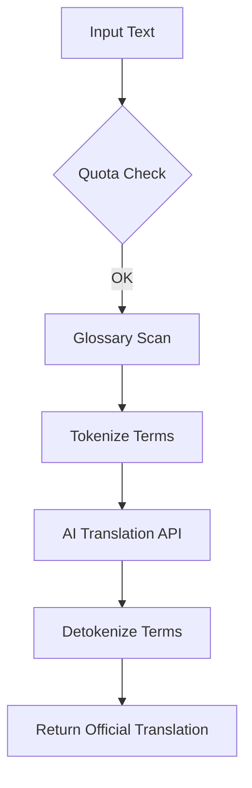

# JanBhasha — जनभाषा
### *Bridging Government Communication, One Word at a Time*

JanBhasha is an AI-powered **Multilingual Translation Platform** built specifically for Indian government organisations. It enables departments to convert official notices, documents, and policies into 22+ Indian languages instantly while preserving domain-specific terminology through a custom glossary system.

---

## 📸 Snapshots & Gallery

| **Landing Page (Light Mode)** | **User Dashboard** |
|:---:|:---:|
|  |  |
| *Modern, responsive landing with AI demo* | *Real-time quota tracking & analytics* |

| **Technical Database (phpMyAdmin)** | **Translation History** |
|:---:|:---:|
|  |  |
| *Structured relational schema for multi-tenancy* | *Full audit logs & status tracking* |

---

## ✨ Key Features

- 🌐 **AI-Powered Translation**: Bidirectional translation between **English and 22+ official Indian languages**.
- 🇮🇳 **Bilingual UI**: One-click toggle between English and Hindi for the entire platform interface.
- 📖 **Smart Glossary**: Per-organisation term overrides that protect official terminology from AI "hallucinations".
- 📊 **Quota Management**: Live tracking of monthly character usage with automated limit enforcement.
- ⚡ **Lightning Fast**: Built with **Vite** and result caching (24h) for sub-second responses.
- 💬 **AI Assistant**: Persistent support chatbot to guide users through translation workflows.
- 🔑 **Developer API**: Robust REST API with organisation-scoped `X-API-Key` authentication.
- 🛡️ **Gov-Standard Security**: Role-based access control (RBAC), secure audit logs, and CSRF protection.

---

## 🛠️ Technology Stack

| Layer | Technology |
|---|---|
| **Backend** | PHP 8.2 / Laravel 12 |
| **Frontend** | Blade + TailwindCSS + Vanilla JS (Dynamic i18n) |
| **Database** | MySQL (XAMPP / Production) |
| **Caching** | Laravel Cache (Redis/File) |
| **AI Engine** | Google Translate API / LibreTranslate |
| **Build Tool** | Vite |

---

## 🚀 Installation & Setup

### Prerequisites
- PHP ≥ 8.2 (with `pdo_mysql`, `curl`, `mbstring` extensions)
- MySQL / MariaDB (XAMPP recommended)
- Composer & Node.js

### Quick Start
1. **Clone & Install**
   ```bash
   git clone https://github.com/rishabhtcodes/JanBhasha.git
   cd JanBhasha
   composer install
   npm install
   ```

2. **Environment Configuration**
   - Copy `.env.example` to `.env`.
   - Update `DB_DATABASE=janbhasha` and your MySQL credentials.
   - Set `TRANSLATION_PROVIDER=mock` (for testing without API keys).

3. **Database Setup**
   ```bash
   php artisan migrate --seed
   ```

4. **Launch Application**
   ```bash
   npm run dev
   php artisan serve --port=8001
   ```

---

## 📊 Platform Architecture

### The Translation Pipeline
JanBhasha ensures accuracy by intercepting text before it reaches the AI engine.



---

## 🔑 REST API Usage

JanBhasha exposes a developer-friendly API for seamless integration into other government portals.

**Endpoint:** `POST /api/v1/translate`  
**Header:** `X-API-Key: jb_<your_key>`

```json
{
  "source_text": "The Ministry of Finance announces...",
  "source_lang": "en",
  "target_lang": "hi"
}
```

---

## 📄 License & Credits

Developed with ❤️ for **Digital India**.  
© 2026 JanBhasha. Hosted by NIC.  
An Initiative by Ministry of Electronics & IT, Government of India.
