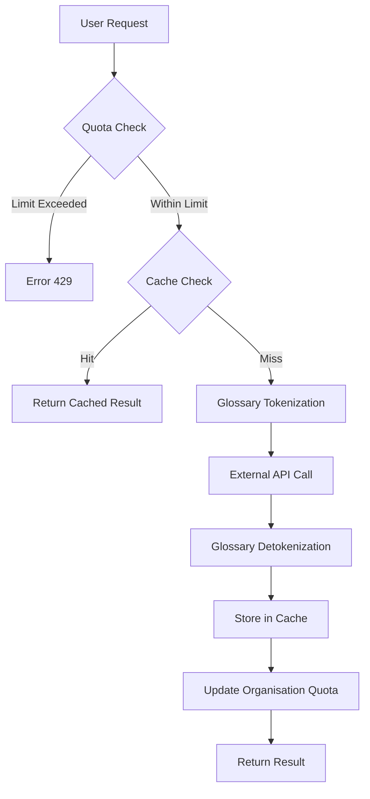
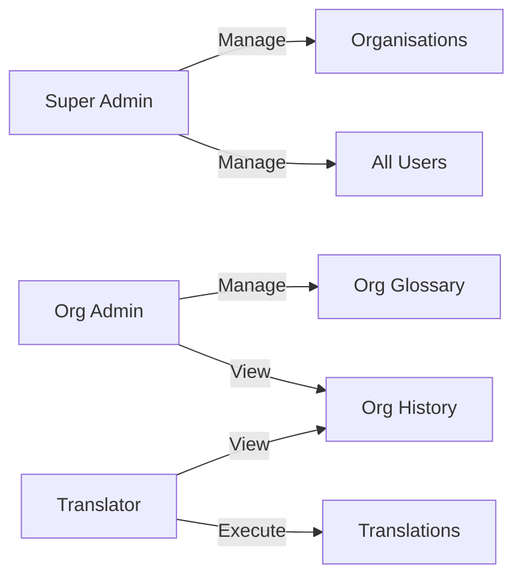

# JanBhasha — जनभाषा
### *Bridging Government Communication, One Word at a Time*

JanBhasha is an AI-powered **English → Hindi translation platform** built for Indian government organisations. It allows government departments to convert official content into Hindi at scale — via a web dashboard or a REST API — while respecting per-organisation monthly character quotas, maintaining a custom glossary, and logging every translation for audit purposes.

---

## 📸 Snapshots & Gallery

| **Landing Page (Light Mode)** | **User Dashboard** |
|:---:|:---:|
|  |  |
| *Modern, responsive landing with AI demo* | *Real-time quota tracking & analytics* |

| **Technical Database (phpMyAdmin)** | **Translation History** |
|:---:|:---:|
|  |  |
| *Structured relational schema for multi-tenancy* | *Full audit logs & status tracking* |

---

## ✨ Features

| Feature | Details |
|---|---|
| 🌐 **Translation** | **Any-to-Any Indian Language** via Google Translate, LibreTranslate, or Mock (dev) |
| 📖 **Custom Glossary** | Per-organisation term overrides; protects domain-specific words from being mangled by the API |
| 📊 **Monthly Quota** | Configurable character limit per organisation with live usage tracking |
| 🗂️ **Translation History** | Full audit log with status (`pending` / `completed` / `failed`), character count, provider, and cache flag |
| ⚡ **Result Caching** | Identical source texts are served from a 24-hour cache — no duplicate API calls |
| 🔑 **REST API** | Organisation-scoped API key authentication (`X-API-Key` header) |
| 🛡️ **Role-Based Access** | `super_admin`, `admin`, `translator` roles with middleware-level enforcement |
| 🏢 **Multi-Tenancy** | Each organisation has its own users, glossary, translations, and API key |
| 🔄 **API Key Rotation** | Super-admins can regenerate an organisation's API key at any time |
| 🌌 **Futuristic UI** | Dark-themed glassmorphism 2026-style interface with animated gradients |
| 💬 **AI Support Bot** | Floating AI assistant for real-time guidance and support |
| 🗺️ **Guided Tour** | Interactive onboarding tour for first-time registered users |
| 🛡️ **Secure Delete** | Mandatory password confirmation for account deletion |

---

## 🛠️ Tech Stack

| Layer | Technology |
|---|---|
| **Backend** | PHP 8.2 / Laravel 12 |
| **Frontend** | Blade Templates + TailwindCSS v4 + Alpine.js |
| **Aesthetics** | **Futuristic Dark Mode** + Glassmorphism + Animated Gradients |
| **AI Engine** | Google Cloud Translation API v2 · LibreTranslate · Free Google Bridge |
| **Database** | SQLite (dev) · MySQL / PostgreSQL (prod) |
| **Authentication** | Laravel Breeze (session) + Laravel Sanctum (API tokens) |
| **Build Tooling** | Vite + `@tailwindcss/vite` |
| **Testing** | PHPUnit 11 |

---

## ⚙️ Installation

### Prerequisites

- PHP ≥ 8.2 with extensions: `mbstring`, `pdo`, `openssl`, `curl`
- Composer
- Node.js ≥ 18 + npm

### Quick Start

```bash
# 1. Clone the repository
git clone https://github.com/rishabhtcodes/JanBhasha.git
cd JanBhasha

# 2. One-command setup (install deps, copy .env, generate key, migrate, build assets)
composer setup

# 3. Start all dev services (server + queue + vite + log watcher)
composer dev
```

> Visit **http://localhost:8000** in your browser.

---

## 📊 Platform Workflows

### 1. The Translation Lifecycle
JanBhasha uses a sophisticated pipeline to ensure high accuracy while preserving official government terminology.



### 2. User Role Hierarchy
Access control is enforced at the middleware level to ensure multi-tenant security.



---

## 🔑 Environment Variables

Copy `.env.example` and configure the following keys:

```env
APP_NAME=JanBhasha
APP_URL=http://localhost

# Database (SQLite by default for development)
DB_CONNECTION=sqlite
# DB_CONNECTION=mysql
# DB_HOST=127.0.0.1
# DB_DATABASE=janbhasha
# DB_USERNAME=root
# DB_PASSWORD=

# Translation provider: "google", "libre", or "mock" (for local testing)
TRANSLATION_PROVIDER=mock
TRANSLATION_API_KEY=your_google_translate_api_key_here

# Required only when TRANSLATION_PROVIDER=libre
TRANSLATION_LIBRE_URL=https://libretranslate.com
```

---

## 🗂️ Database Schema

```
organisations      – government departments (name, slug, api_key, monthly_char_limit, is_active)
users              – platform users; belongs to one organisation; role: super_admin | admin | translator
translations       – every translation request (source, result, provider, status, characters, is_cached)
glossaries         – per-org custom term overrides (source_term → target_term, case_sensitive)
```

> Soft-deletes are enabled on `organisations` and `translations`.

---

## 🌐 Web Routes

All web routes require session authentication via Laravel Breeze.

| Method | URI | Description |
|---|---|---|
| `GET` | `/dashboard` | User dashboard with translation stats |
| `GET/POST` | `/translations` | List history & submit new translation |
| `GET` | `/translations/{id}` | View a single translation result |
| `DELETE` | `/translations/{id}` | Soft-delete a translation record |
| `GET/POST` | `/glossary` | List & add glossary terms |
| `GET/PUT/DELETE` | `/glossary/{id}` | Edit or remove a glossary term |
| `GET` | `/profile` | Edit profile (Breeze) |
| `GET` | `/admin` | Super-admin dashboard (super_admin only) |
| `CRUD` | `/admin/organisations` | Manage organisations |
| `POST` | `/admin/organisations/{org}/regenerate-key` | Rotate API key |
| `CRUD` | `/admin/users` | Manage users |

---

## 🔌 REST API

All API routes are prefixed with `/api/v1` and require an `X-API-Key` header matching an active organisation's API key.

### Authentication

```http
X-API-Key: jb_<your-organisation-api-key>
```

### Endpoints

#### `POST /api/v1/translate`

Submit text for translation.

**Request Body**
```json
{
  "source_text": "The Ministry of Finance hereby announces...",
  "source_label": "Budget Circular 2025",
  "source_lang": "en",
  "target_lang": "hi"
}
```

**Response** `201 Created`
```json
{
  "success": true,
  "translation_id": 42,
  "source_text": "The Ministry of Finance...",
  "translated_text": "वित्त मंत्रालय एतद्द्वारा घोषणा करता है...",
  "provider": "google",
  "characters": 48,
  "is_cached": false,
  "created_at": "2025-04-25T10:30:00+05:30"
}
```

---

#### `GET /api/v1/history`

Retrieve paginated translation history.

**Query Parameters**
| Param | Description |
|---|---|
| `status` | Filter by `completed`, `failed`, or `pending` |
| `per_page` | Results per page (default: 20, max: 100) |

---

#### `GET /api/v1/usage`

Check the organisation's monthly character quota.

**Response** `200 OK`
```json
{
  "success": true,
  "organisation": "Ministry of Finance",
  "monthly_quota": 500000,
  "characters_used": 128430,
  "characters_left": 371570,
  "quota_percent": 25.69
}
```

---

## 🔒 Roles & Permissions

| Role | Capabilities |
|---|---|
| `super_admin` | Full access — manage all organisations, users, and admin panel |
| `admin` | Manage translations and glossary within their own organisation |
| `translator` | Submit translations and view history within their organisation |

> Users without an `organisation_id` are blocked from performing translations.

---

## 📖 Glossary System & Tokenization

The glossary is a critical component that prevents the translation engine from "hallucinating" or incorrectly translating official terminology.

### Technical Implementation:
1.  **Tokenization**: Before the source text is sent to the API, it is scanned for terms registered in the organisation's glossary. Each match is replaced with a unique, non-translatable token (e.g., `[[JBTK_0]]`, `[[JBTK_1]]`).
2.  **API Neutrality**: The translation provider (Google/Libre) receives the tokenized text. Because tokens are wrapped in double brackets, the AI recognizes them as literal strings and preserves them in the output.
3.  **Detokenization**: Upon receiving the translated text, the `GlossaryService` replaces the tokens with the pre-approved target terms in the correct language.

This ensures that "Ministry of Finance" always becomes "वित्त मंत्रालय", even if the translation model would have chosen a different synonym.

---

## 📁 Project Structure

```
JanBhasha/
├── app/
├── Http/
│   ├── Controllers/
│   │   ├── Api/TranslationController.php  ← REST API
│   │   ├── AdminController.php            ← Super-admin panel
│   │   ├── DashboardController.php
│   │   ├── GlossaryController.php
│   │   ├── OrganisationController.php
│   │   ├── TranslationController.php      ← Web UI
│   │   └── ProfileController.php
│   ├── Middleware/
│   │   └── AuthenticateApiKey.php         ← X-API-Key validation
│   └── Requests/
│       ├── StoreTranslationRequest.php
│       ├── StoreOrganisationRequest.php
│       └── StoreGlossaryRequest.php
├── Models/
│   ├── User.php
│   ├── Organisation.php
│   ├── Translation.php
│   └── Glossary.php
└── Services/
    ├── TranslationService.php             ← Orchestrates quota, cache, glossary, provider
    ├── GlossaryService.php                ← Tokenise / detokenise
    └── Providers/
        ├── GoogleTranslateProvider.php
        └── LibreTranslateProvider.php
├── database/
│   └── migrations/
│       ├── ..._create_organisations_table.php
│       ├── ..._add_organisation_id_to_users_table.php
│       ├── ..._create_translations_table.php
│       └── ..._create_glossaries_table.php
├── resources/views/
│   ├── admin/           ← Super-admin dashboard, organisations, users
│   ├── translations/    ← Create, index, show
│   ├── glossary/        ← Create, edit, index
│   └── layouts/
├── routes/
│   ├── web.php          ← Authenticated web routes
│   └── api.php          ← /api/v1 REST routes
└── tests/
    ├── Unit/GlossaryServiceTest.php
    └── Feature/TranslationApiTest.php
```

---

## 🧪 Testing

```bash
# Run all tests
composer test

# Run only unit tests
php artisan test --testsuite=Unit

# Run only feature tests
php artisan test --testsuite=Feature
```

Test coverage includes:
- `GlossaryServiceTest` — tokenization, detokenization, case-sensitivity
- `TranslationApiTest` — API key auth, quota enforcement, caching behaviour, history pagination

---

## 📄 License

This project is developed for use by Indian Government Organisations.  
© 2026 JanBhasha. All rights reserved. Built with pride for Digital India.

---

## 🚀 What's New in the 2026 Overhaul

The latest update transforms JanBhasha into a cutting-edge portal with several major upgrades:

### 1. Futuristic 2026 UI/UX
- **Dark-Glassmorphism Design**: A sleek, premium interface using modern transparency and blur effects.
- **Animated Gradients**: Dynamic, smooth background transitions for a "living" application feel.
- **Grid Overlays**: High-tech architectural aesthetics inspired by 2026 design trends.
- **Custom Favicon**: New Ashoka Chakra branding integrated across the entire platform.

### 2. Multi-Language Indian Support
- **Any-to-Any Translation**: Beyond English-to-Hindi, the system now supports bidirectional translation between all 22+ official Indian languages (Bengali, Tamil, Telugu, Marathi, etc.).
- **Swap Toggle**: A new interactive button to instantly reverse translation direction.

### 3. AI-Powered Support & Onboarding
- **Floating Chatbot**: A persistent 💬 help assistant that provides quick-replies and real-time guidance.
- **Guided Onboarding Tour**: A 6-step interactive walkthrough that triggers automatically for new users (skippable).
- **Tour Completion Tracking**: The system remembers if a user has completed the tour via the new `tour_completed` database flag.

### 4. Enhanced Account Security
- **Safe Account Deletion**: Deleting a profile now strictly requires the user's **current password** in a secure modal overlay, preventing accidental or unauthorized account removal.
